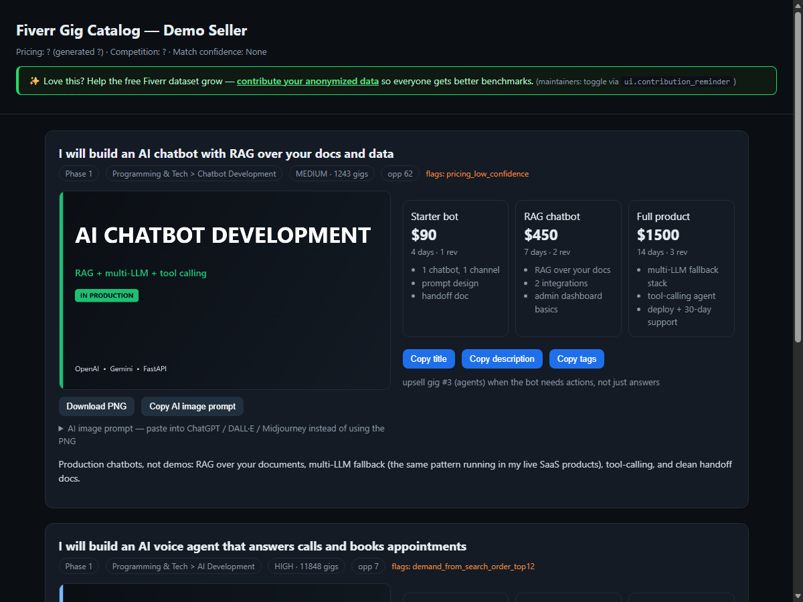

<div align="center">


# fiverr-gig-optimizer

**gig research that refuses to guess** 📋


<br/>


<br/>



*The deliverable: every score carries a provenance line telling you where the number came from.*

</div>

<br/>

A Claude Code skill that turns your list of services into an optimized,
research-backed Fiverr gig catalog — titles, tags, 3-tier pricing,
descriptions, thumbnail specs, a phase-based launch plan, and a cross-sell map.
**Every market number it reports — competition, demand, competitor prices —
comes from a deterministic Python script operating on real data. It never
guesses.**

## Why this isn't a fluff tool


Most "Fiverr optimizer" prompts tell the model to *mentally estimate* how many
competitors a keyword has and what to charge. That output is hallucinated and
changes every run. Here, the LLM never produces a market figure. Competition,
demand, and pricing are computed by auditable scripts (`score_keyword.py`,
`query_dataset.py`, `analyze_pricing.py`) from data you can see. If the data
isn't there, the skill asks you or says it doesn't have it.

Offer-design choices (delivery days, revisions, what's in each package) *are*
authored by the model — those are your decisions, not market measurements.

## Install

```
/plugin marketplace add Ahad690/fiverr-gig-optimizer
/plugin install fiverr-gig-optimizer@fiverr-tools
```

For reproducible installs, pin to a release tag or commit SHA. Validate locally
with `claude plugin validate .`.

## The three data paths

1. **Sample data (default, free).** Ships with `benchmarks.sample.json` and a
   deterministic keyword lookup (`query_dataset.py`). **The sample data is
   partial and dated** — every result is labeled with its dataset date and a
   match confidence (HIGH / MEDIUM / LOW). On a weak match the skill asks you
   for a count instead of inventing one.
2. **Manual counts.** Open Fiverr, search your keyword, paste the
   "X services available" count. The skill scores exactly that number.
3. **Live scrape (opt-in).** `scrape.py` reads fresh gigs for your categories
   and — uniquely — recovers the real search total as `gig_count_in_search`.
   The **default engine needs no API key** (works from a residential IP; set
   `PROXY_URL` otherwise). An optional **Apify fallback** (your key) covers
   proxy-backed retries. Then `build_benchmarks.py` builds the pricing pools
   and lookup index.

### Live-scrape engines

- **Default (no key):** a vendored Perseus reader
  (`scripts/vendor/`, MIT — from `KyuRish/fiverr-mcp-server`) parses Fiverr's
  page data via browser-TLS impersonation. Best from a **residential IP**;
  otherwise set `PROXY_URL` to a residential proxy. This is the **only** engine
  that returns `gig_count_in_search` (the "X services available" total).
  Needs `curl-cffi` + `beautifulsoup4` (`pip install -r requirements.txt`).
- **Fallback (Apify, optional):** run with `--engine apify`, pass
  `--api-key`/`APIFY_TOKEN`, and set `scraper.actor_id` in
  `scoring-config.json`. It **cannot** supply the search total (use a manual
  count for that). Scraping costs are yours.

### Import your existing Fiverr profile (optional)

Already selling? Paste your profile link and the skill pre-fills Step 1 instead
of asking you to type everything:

```
python3 scripts/import_profile.py --url https://www.fiverr.com/<username>
```

It returns your display name, seller level, and **each existing gig with its
current packages (prices, delivery, tags)** plus service seeds for keyword
ideas — so the skill can benchmark *your* prices against the market and rewrite
gigs you already have. **Public data only:** no login, and no private analytics
(impressions, clicks, earnings). Same residential-IP/`PROXY_URL` rules as the
scrape engine.

## Scoring (auditable, tunable)

All constants live in `references/scoring-config.json`.

- **Competition score (0–100, higher = less competition).** Piecewise-linear
  over `log10(gig_count)`, anchored `(1→100), (200→70), (2000→40), (20000→0)`.
  Example: `gig_count=24 → 82` (LOW). `gig_count=0 → UNTESTED` (not a top score).
- **Demand score.** Median review count of the top competitors, normalized to a
  ceiling. `null` when no competitor data is available — never guessed.
- **Opportunity.** `0.6·competition + 0.4·demand` (competition-only, flagged,
  when demand is unavailable).
- **Pricing.** Per-tier percentiles of real competitor prices: Basic = p25,
  Standard = median, Premium = p75 (new sellers shift lower to win first
  reviews). Tiers with too few samples are flagged low-confidence.

Edit the anchors, weights, thresholds, and FX table to retune — nothing is
hidden in the model.

## Contributing data


Contribution is **opt-in and OFF by default** — nothing is shared unless you
explicitly run `contribute.py` *without* `--dry-run` **and** set `HF_TOKEN`.
There is no background upload and no auto-share setting.

1. **Preview (shares nothing):**
   `python3 scripts/contribute.py --input benchmarks.local.json --dry-run`
   prints the exact cleaned, de-duplicated rows that *would* be shared.
2. **Turn it on:** set `HF_TOKEN`, then
   `python3 scripts/contribute.py --input benchmarks.local.json --contributor "Your Name"`
   opens a pull request to the community Hugging Face dataset.

`contribute.py` strips all seller-identifying fields to the keep-list,
deduplicates, and credits you in `CONTRIBUTORS.md`. A PII guard aborts the
upload if any disallowed field is present. See [`DATA_POLICY.md`](DATA_POLICY.md)
for the full keep/strip list.

**One step from a scrape:** `scrape.py … --contribute --token <hf>` runs the same
anonymized upload right after scraping. It's **token-gated and always announced**
— never a silent background push. To make it habitual, set
`scraper.auto_contribute: true` in `scoring-config.json` (still requires a token;
still prints what it's sharing).

**No data is ever destroyed.** Every scrape **accumulates** into the local file
by default (append-only, de-duped), so your benchmark grows across runs and is
always ready to contribute later. `--overwrite` starts fresh but first renames
the previous file to a timestamped `.bak-*.json`; an unreadable file is
preserved as `.corrupt-*.json` rather than clobbered; all writes are atomic.

### Refreshing from the community dataset (the read side)

As the shared dataset grows, pull it back into your local sample to improve
Path A results:

```
python3 scripts/refresh_dataset.py             # validate + merge clean new rows
python3 scripts/refresh_dataset.py --dry-run   # preview only, write nothing
```

It merges only data that is **uncorrupted** (every row is schema-validated; a
file that won't parse or a corrupt fraction above `--max-corrupt-ratio` is
**refused**, leaving your local file untouched) and **sufficient** (it no-ops if
there are fewer than `--min-new` clean, new rows). Scoring keeps reading the
local file afterwards, so determinism is preserved — the file just gets richer.

### Auto-merging contributions (maintainer bot)

When contributions arrive faster than you can review them,
`automerge_prs.py` merges the safe ones automatically:

```
python3 scripts/automerge_prs.py --dry-run   # decide only, merge nothing
python3 scripts/automerge_prs.py             # merge clean PRs, hold the rest
```

It auto-merges a PR **only** when it's purely additive (`contributions/*.json`
only — nothing removed or modified), under `--max-rows`, and every row passes
schema/range/PII validation (`--max-corrupt-ratio`, default `0` = any invalid
row holds the PR). Anything else is commented and left open for a human. The
scheduled GitHub Action `.github/workflows/automerge-dataset-prs.yml` runs it for
you — add an `HF_TOKEN` repo secret with write scope.

**Caveat:** schema validation proves rows are well-formed and PII-free, not that
the numbers are *authentic*. Auto-merge trades human review for scale; the
dataset is versioned, so any bad merge is revertible. Tighten the gates, or keep
the Action on `--dry-run` and merge by hand, if you prefer.

#### CI token setup

The Action authenticates with a Hugging Face token stored as the repo secret
`HF_TOKEN`. Create a **fine-grained** token at
[huggingface.co/settings/tokens](https://huggingface.co/settings/tokens),
scoped to **just the dataset repo** (least privilege). Under **Repositories
permissions**, add your `<owner>/fiverr-gigs` repo and check exactly:

- **Write access to contents/settings of selected repos** — create commits / merge PRs
- **Interact with discussions / Open pull requests on selected repos** — open, comment, merge

Leave everything else unchecked (no Inference, Webhooks, Billing, Jobs, Org).
Then set the secret:

```
gh secret set HF_TOKEN -R <owner>/fiverr-gig-optimizer
```

Use a **dedicated fine-grained token**, not an `hf auth login` OAuth token —
OAuth tokens expire and will eventually break the scheduled run.
(`refresh_dataset.py` needs no token; it only reads the public dataset.)

## No ML, no auto-scraping, no guessed numbers

- No machine learning, training, or ranking prediction — scoring is rule-based.
- No scraping by default; live scraping is opt-in (the default engine needs no
  key — an Apify key is only for the optional fallback).
- No model-estimated competition counts or prices, anywhere.

## License

- **Code:** MIT — [`LICENSE`](LICENSE).
- **Data + docs:** CC-BY-4.0 — [`LICENSE-DATA`](LICENSE-DATA).
- Community dataset (CC-BY-4.0): set in `scoring-config.json → dataset_repo`
  (`https://huggingface.co/datasets/Ahad690/fiverr-gigs`).

## Troubleshooting

- **No Chrome/Edge:** `build_pdfs.py` warns and exits 0; the HTML catalog still
  renders. PDFs are optional.
- **Scrape returns nothing / "blocked":** the primary engine relies on TLS
  impersonation. It works from a residential IP; from a datacenter/VPN IP set
  `PROXY_URL` to a residential proxy, or configure the Apify fallback (with a key).
- **HTTP 429 on scrape:** you're rate-limited — wait and retry, or lower
  `--limit` (the engine already throttles ~2s/request; raise `RATE_LIMIT_DELAY`).
- **Low-confidence pricing:** a tier had fewer than `min_samples` prices; the
  number is shown but flagged. Add data (manual or scrape) to firm it up.
- **Low match confidence / no match:** the sample dataset doesn't cover your
  keyword well; paste the Fiverr count (Path B) so the skill can score it.

## Development

```
python -m unittest discover -s tests -p "test_*.py" -v
```

Project layout, scoring spec, and build order live in
`fiverr-gig-optimizer-PRD-v1.1.md`.

## Related projects (same honesty architecture)

fiverr-gig-optimizer is part of a family of **local-first, no-fabricated-numbers
Claude Code skills** — deterministic scripts, provenance-labeled outputs, an
HTML deliverable, append-only local data, opt-in federation. The shared design
is documented in [patterns/hf-community-dataset](patterns/hf-community-dataset/HF_AUTOMERGE_PATTERN.md).

- [**GrowthKit**](https://github.com/Ahad690/growthkit-skill) — honest
  short-form-video marketing (TikTok/Reels/Shorts) for SaaS & apps.
- [**AppScope** (open-app-intel)](https://github.com/Ahad690/open-app-intel) —
  self-hosted app market intelligence with confidence-banded estimates.

<div align="center">

<br>
<sub><code>~ end of file · zero numbers were guessed ~</code></sub>

</div>
